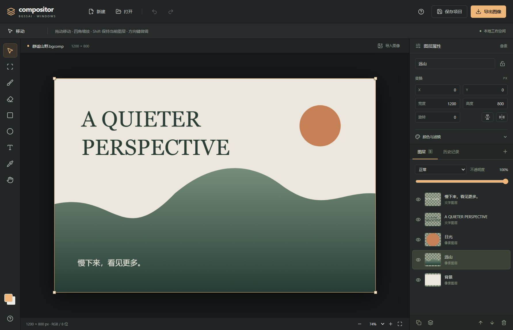

# BGSSAI Compositor for Windows

一款离线、以图层为核心的 Windows 图像编辑软件。首版 `0.1.0` 参考 [robbietilton/Compositor](https://github.com/robbietilton/Compositor) 的 Photoshop 式合成工作流，使用 Electron、React、TypeScript 和 Canvas 2D 独立实现 Windows 桌面应用。

产品名使用 **bgssai-compositor**；当前 GitHub 仓库名保留为 `bgssai-compossitor`。

## 使用 Windows 版

面向 Windows 10 / Windows 11 **x64**；建议 8 GB 或以上内存。当前构建未进行商业代码签名，也没有自动更新。

- 免安装版：`BGSSAI-Compositor-0.1.0-win-x64-portable.exe`，双击即可启动。
- 安装版：`BGSSAI-Compositor-0.1.0-win-x64-setup.exe`，可选择安装目录，并创建桌面快捷方式。
- PR / `develop` 分支的 GitHub Actions 在 Windows 上验证并生成上述文件；构建成功后在对应运行页面下载 `BGSSAI-Compositor-Windows-x64` artifact。
- 所有编辑和文件读写都在本地进行；运行应用不需要账号、服务器或联网。

打开应用后可以创建画布、打开图片，或点击“打开示例”探索由多个可编辑图层组成的示例作品。



## 首版功能

| 工作流     | 已支持                                                                         |
| ---------- | ------------------------------------------------------------------------------ |
| 文件       | 新建自定义画布；打开 PNG / JPEG / WebP / BMP；导入图片为图层；拖放和粘贴图片   |
| 图层       | 新增、复制、删除、重命名、显隐、锁定；按钮或拖动排序；正常混合模式图层向下合并 |
| 合成       | 图层不透明度；正常、正片叠底、滤色、叠加、柔光等 16 种混合模式                 |
| 变换       | 拖动移动、四角等比缩放、数值位置和尺寸、旋转、水平/垂直翻转；保留原始像素      |
| 绘画       | 画笔、橡皮擦；大小和不透明度；笔输入压力；前景色和吸管                         |
| 选区       | 矩形选区限制绘画/擦除范围；删除选区内像素；裁切画布；Shift 等比选择            |
| 文字与形状 | 可编辑多行文字、字体、字号、颜色、粗体及文字栅格化；矩形、椭圆                 |
| 调整       | 每图层非破坏性亮度、对比度、饱和度和模糊                                       |
| 历史       | 撤销、重做、历史面板；更改后关闭或打开新文档前提醒保存                         |
| 画布       | 5%–400% 缩放、适合窗口、实际像素、抓手、Ctrl+滚轮缩放                          |
| 输出       | `.bgcomp` 可编辑项目；PNG 透明无损导出；JPEG 质量和透明区域填充色              |

### 当前边界

- **不是上游全部功能的等价移植**：首版不支持 PSD/PSB、RAW、CMYK、图层蒙版、魔棒/套索、AI 抠图、修复/仿制、图层组或多文档标签。
- 编辑器采用 RGB / 8 位 Canvas 工作流，无 ICC 色彩管理、印刷软打样或 EXIF 保留承诺。
- 矩形、椭圆创建为像素图层；文字保持可编辑，栅格化后不能恢复文字内容，除非撤销。
- 非正常混合模式的图层须先改为正常，才能向下合并，以免破坏依赖背景的合成效果。
- 每个文档最多 1677 万像素，单边最多 8192 px；最多 40 个图层，总图层像素不超过 4800 万；文件和项目上限 128 MB。
- 历史记录最多 30 步，并受约 96 MB 的序列化快照预算限制；大项目会自动保留更少的步骤。
- 尚未加入自动恢复和自动保存，请定期按 `Ctrl+S` 保存项目。

## 常用快捷键

| 操作                        | Windows 快捷键                             |
| --------------------------- | ------------------------------------------ |
| 新建 / 打开 / 导入为图层    | Ctrl+N / Ctrl+O / Ctrl+Shift+O             |
| 保存 / 另存为 / 导出        | Ctrl+S / Ctrl+Shift+S / Ctrl+Shift+E       |
| 撤销 / 重做                 | Ctrl+Z / Ctrl+Shift+Z（或 Ctrl+Y）         |
| 复制图层 / 取消选区         | Ctrl+J / Ctrl+D                            |
| 移动 / 选区 / 画笔 / 橡皮擦 | V / M / B / E                              |
| 矩形 / 椭圆 / 文字 / 吸管   | U / O / T / I                              |
| 抓手 / 临时抓手             | H / 按住空格                               |
| 适合窗口 / 实际像素         | Ctrl+0 / Ctrl+1                            |
| 画笔大小                    | [ / ]                                      |
| 移动图层微调                | 方向键，Shift+方向键移动 10 px             |
| 删除                        | 有选区时清除选区像素，无选区时删除当前图层 |

## 本地开发与构建

需要 Node.js **24**、npm 和 Windows x64。首次安装依赖需要联网下载 Electron。

```powershell
npm ci
npm run dev
```

验证和生成可执行文件：

```powershell
npm run check
npm run dist:win -- --publish never
npm run test:package
npm run test:portable
```

生成的安装版、免安装版和未打包目录位于 `release/`。`release/`、`dist/` 和 `node_modules/` 不提交到 Git。

`npm run build` 执行 TypeScript 类型检查和渲染器构建；`npm start` 启动已经构建好的桌面程序。`npm run test` 检查项目格式和变换坐标；`npm run test:e2e` 在真实 Electron 中验证像素编辑、图层操作、文件往返和导出。测试使用应用自带的 Electron，无需下载 Playwright 浏览器。

安装脚本使用 Electron 官方下载接口及官方校验和，并用 Windows 内置 ZIP 解压器安装运行时，避免部分 Windows 系统无法加载 Electron 44 原生 ZIP 解压模块的问题。

### 分支与环境

- 所有源码修改通过工作分支的 draft PR 交付到 `develop`，默认由用户在 GitHub 上合并。
- `dev` 与 `prod` 都使用 `develop` 分支；只通过 `config/application-dev.properties` / `config/application-prod.properties` 区分配置。
- `npm run dev` 读取开发配置；打包应用始终读取生产配置。当前为本地桌面应用，暂无需要部署的服务端。
- CI 在 PR 中验证候选代码，在 `develop` 的 push 后生成同样的 Windows 构建；不自动发布 Release 或合并 PR。

## 项目结构

```text
electron/      Windows 主进程、隔离的 preload 和本地文件对话框
src/           中文工作台、Canvas 图像引擎、项目格式校验
config/        dev / prod properties
build/         原创应用图标
scripts/       开发启动、运行时安装及图标生成
tests/         文件格式单元测试与真实桌面端到端测试
docs/          项目文件格式与架构说明
```

## 参考与许可

参考项目 [Compositor](https://github.com/robbietilton/Compositor) 是 Robbie Tilton 创建的 macOS 图像编辑应用，采用 MIT 许可。本项目参考其编辑工作流，没有复制或编译其 Swift 源码；Windows 代码、示例图形和图标为独立实现。本仓库代码采用 [MIT License](LICENSE)。React、Electron 等依赖遵循其各自的许可；Windows 包含 Electron 的第三方许可文件。
